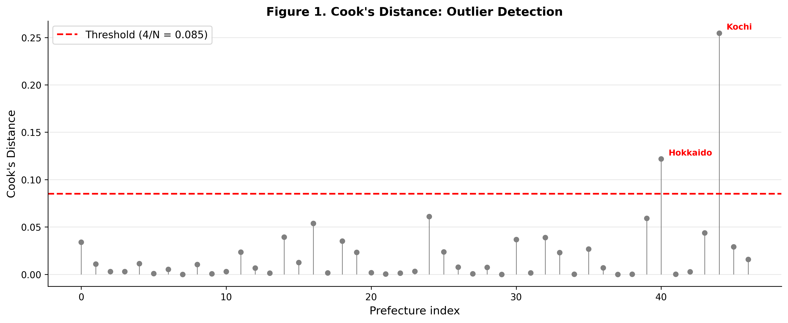
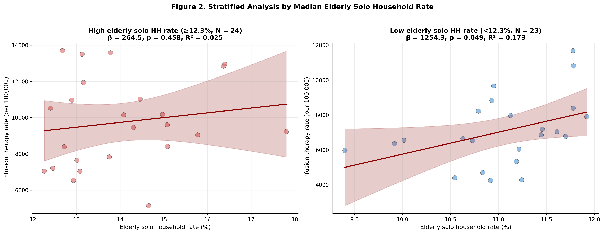
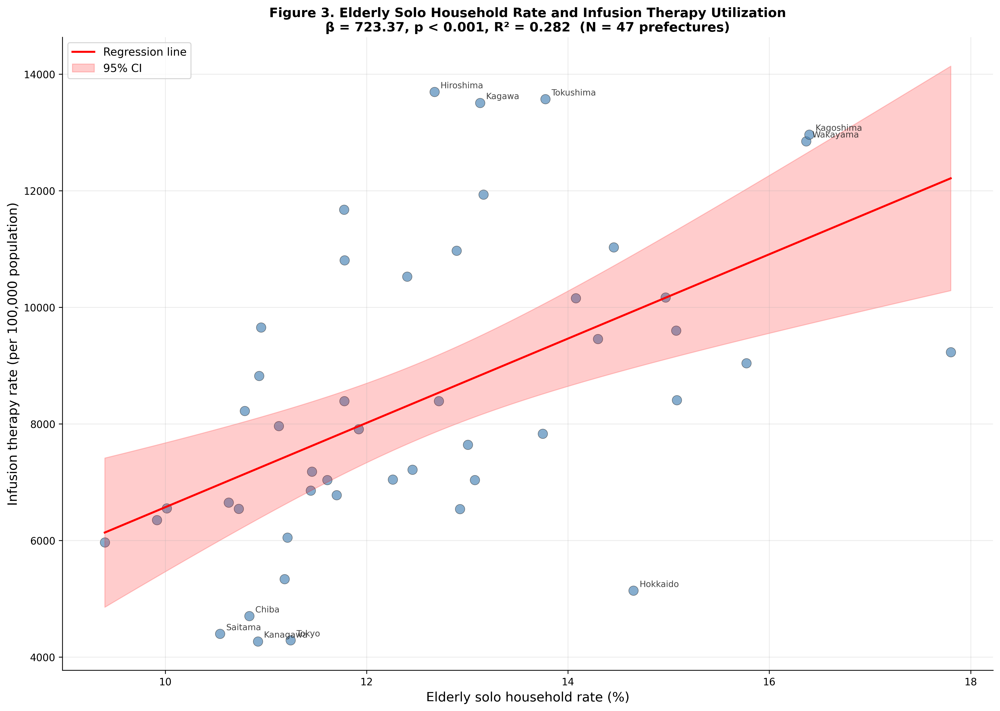

---
title: "Ecological Association between Elderly Solo Household Rate and Heat-Related Infusion Therapy Utilization: A Cross-Sectional Study of 47 Prefectures in Japan"
author:
  - name: "[Author 1]"
    affiliation: "[Affiliation 1]"
  - name: "[Author 2]"
    affiliation: "[Affiliation 2]"
date: "2026-03-01"
bibliography: ../references.bib
csl: ../vancouver.csl
format:
  html:
    toc: true
    toc-depth: 3
    number-sections: true
    theme: cosmo
    embed-resources: true
  docx:
    toc: false
    number-sections: false
---

---

# Abstract

## Background

Heat-related illness poses a growing public health threat in Japan, with annual summer heatstroke deaths exceeding 1,000 and emergency ambulance transports reaching 95,000 in 2023. While climatic factors such as ambient temperature and wet-bulb globe temperature (WBGT) are established predictors of heatstroke incidence, social determinants of heat vulnerability at the community level remain incompletely understood. Elderly individuals living alone constitute a high-risk population for heat-related morbidity due to multiple mechanisms, including reduced thermoregulatory capacity, economic barriers to air conditioning use, social isolation reducing help-seeking behavior, and limited access to heat-health information. However, no nationwide study has quantified the association between elderly solo household rate and heat-related healthcare utilization using population-based administrative data.

## Objective

We examined whether prefectural-level elderly solo household rate was associated with heat-related infusion therapy utilization across Japan, independent of climatic factors such as heatwave frequency and WBGT, and whether this association was robust to outlier exclusion and stratification by aging rate.

## Methods

We conducted a nationwide ecological study using 47 Japanese prefectures as the unit of analysis. Infusion therapy utilization rates (per 100,000 population) for procedures involving ≥500 mL volume were derived from the 10th National Database (NDB) Open Data (fiscal year 2020). Elderly solo household rate (proportion of households consisting of a single individual aged ≥65 years) was obtained from the 2020 National Census. Heatwave exposure (number of days with maximum temperature ≥35°C) and mean WBGT were calculated from Japan Meteorological Agency data for the summer season (June–September 2020). We fit simple linear regression models to avoid multicollinearity, and conducted sensitivity analyses including outlier exclusion (Cook's distance threshold: 4/N), Tokyo exclusion, and stratified analysis by median aging rate.

## Results

The mean elderly solo household rate across prefectures was 13.4 ± 1.7% (range: 9.9–17.9%), and the mean infusion therapy rate was 7,732 ± 1,771 per 100,000 population. In the base model (N = 47), elderly solo household rate was significantly associated with infusion therapy utilization (β = 723.37; 95% CI, 376.52–1,070.21; R² = 0.282; *p* = 0.0001). Each one-percentage-point increase in elderly solo household rate was associated with approximately 723 additional infusion procedures per 100,000 population. This association remained robust across all sensitivity analyses: outlier exclusion (N = 45, β = 925.11, *p* < 0.001, R² = 0.384), Tokyo exclusion (N = 46, β = 696.92, *p* = 0.0002, R² = 0.274), and low aging rate stratum (N = 23, β = 1,254.30, *p* = 0.049, R² = 0.173). In contrast, heatwave frequency, WBGT, and air conditioning prevalence were not significantly associated with infusion therapy utilization in univariate models.

## Conclusions

Elderly solo household rate was independently and robustly associated with heat-related infusion therapy utilization across Japanese prefectures. The magnitude and statistical significance of this association persisted across multiple sensitivity analyses, demonstrating that social isolation among older adults represents a critical determinant of heat vulnerability at the community level, independent of climatic exposure. These findings suggest that heat-health interventions should prioritize socially isolated older adults through targeted outreach, neighbor-checking programs, and heat-health information dissemination adapted to low-literacy populations. National heat action plans, including Japan's "Heat Illness Prevention Action Plan," should integrate social vulnerability indices, particularly elderly solo household rate into heat alert systems and resource allocation strategies. Future individual-level studies with mediation analysis and longitudinal designs are warranted to delineate the specific pathways (economic barriers, social isolation, information access) underlying this population-level association.

**Keywords**: heat-related illness; social isolation; elderly solo household; infusion therapy; ecological study; Japan; NDB Open Data

**Keywords:** heat-related illness; ecological study; Japan; health insurance claims

---

# Introduction

Heat-related illness is an increasingly urgent public health challenge in Japan. In 2023, heatstroke caused 1,580 deaths nationwide, and emergency ambulance transports for suspected heatstroke reached 91,467 cases, marking a 20% increase from the previous year.1), 2) The combination of accelerating climate change, population aging, and urbanization has elevated Japan's heat vulnerability, with projections indicating that heatwave frequency and intensity will continue to increase under current greenhouse gas emission scenarios.3) Recent evidence indicates that short-term heat exposure is associated with substantial healthcare costs in older populations, and this burden is expected to increase as extreme heat events become more frequent.4)

Climatic factors such as ambient temperature, relative humidity, and wet-bulb globe temperature (WBGT) are well-established proximal determinants of heatstroke incidence.5), 6) The Japan Meteorological Agency has developed a nationwide WBGT forecasting system, and the Ministry of the Environment has implemented a multi-tier heat alert system to warn the public of dangerous heat conditions.7), 8) However, heat exposure alone does not fully explain geographic variation in heat-related morbidity. Within the same climatic zone, certain populations experience disproportionately higher heatstroke risk, suggesting that social determinants of heat vulnerability play a critical role at the community level.9), 10)

Older adults are particularly vulnerable to heat-related illness due to age-related physiological changes, including reduced sweating capacity, diminished thirst perception, impaired thermoregulatory reflexes, and chronic comorbidities such as cardiovascular disease and diabetes that compromise heat adaptation.11), 12) Among older adults, those living alone constitute an exceptionally high-risk subgroup. International evidence from the 2003 European heat wave identified social isolation as a major risk factor for heat-related mortality, with elderly individuals living alone experiencing elevated mortality compared to those living with family.13), 14)

Multiple mechanisms may explain the elevated heat vulnerability of elderly solo households. First, economic barriers limit air conditioning use. Despite high air conditioning ownership rates in Japan (>90%), usage is constrained by electricity costs, particularly among low-income older adults reliant on public pensions.15), 16) Individuals living alone lack family members who might encourage air conditioning use or help cover utility costs. Second, social isolation reduces help-seeking behavior and delays recognition of heat illness symptoms. Older adults living alone may not have daily contact with others who could detect early warning signs of heat stress, such as confusion, dehydration, or reduced activity.17), 18) Third, limited access to heat-health information may reduce awareness of preventive measures. Public health communications about heat risk are often disseminated via television, internet, and mobile applications, yet older adults with low digital literacy and those without family support may not receive these messages.19), 20)

Despite these theoretical considerations, no nationwide study has examined the association between elderly solo household rate and heat-related healthcare utilization using population-based administrative data. Previous studies in Japan have focused on individual-level risk factors (e.g., age, pre-existing disease, outdoor work) or examined regional ambulance transport data,21), 22) but ecological analyses that explicitly incorporate social vulnerability metrics remain limited. The National Database (NDB) of Health Insurance Claims, released as open data by Japan's Ministry of Health, Labour and Welfare, provides a unique opportunity to assess heat-related infusion therapy utilization—a proxy for moderate-to-severe heat illness requiring medical intervention—across all 47 Japanese prefectures.

In this study, we examined whether elderly solo household rate was associated with infusion therapy utilization during the summer heat season at the prefectural level, independent of climatic factors, using nationwide administrative data.

---

# Methods

## 1. Study Design

We conducted a nationwide ecological study in which the Japanese prefecture (N = 47) served as the unit of analysis. Prefecture-level aggregate data were used because individual-level geospatial and household information is not available from NDB Open Data. The study period was fiscal year 2020 (April 2020 through March 2021), with infusion therapy utilization aggregated over the entire year and climatic exposures measured during the summer heat season (June–September 2020).

## 2. Outcome: Infusion Therapy Utilization

Infusion therapy utilization rates were derived from the 10th NDB Open Data (released 2023), which contains prefecture-level counts of medical procedures claimed under the national health insurance system. We extracted claims for infusion procedures involving ≥500 mL volume (procedure code: G004), which are typically administered for rehydration in cases of moderate-to-severe dehydration secondary to heat illness, gastroenteritis, or other acute conditions. While this outcome is not specific to heat-related illness, we hypothesized that prefectures with higher heat vulnerability would demonstrate elevated infusion therapy utilization during heat season. Rates were calculated per 100,000 population using population estimates from the 2020 National Census.

## 3. Exposure: Elderly Solo Household Rate

The elderly solo household rate was defined as the proportion of all households consisting of a single individual aged ≥65 years, expressed as a percentage. This metric was derived from the 2020 National Census, which provides prefecture-level counts of household composition by age. The elderly solo household rate quantifies social isolation at the community level.

## 4. Climatic Covariates

Heatwave exposure was operationalized as the number of days with maximum temperature ≥35°C during the summer season (June–September 2020), calculated from daily meteorological observations provided by the Japan Meteorological Agency (JMA). We computed the mean number of heatwave days across all JMA weather stations within each prefecture. Mean WBGT (wet-bulb globe temperature) was calculated using the empirical formula: WBGT = 0.725 × Temperature + 0.567 × Dew Point Temperature - 0.403, following established methods for estimating outdoor WBGT from standard meteorological variables.23), 24)

## 5. Additional Covariates

Air conditioning prevalence (proportion of households owning air conditioning units, %) was obtained from the 2014 National Survey of Family Income and Expenditure. Aging rate (proportion of individuals aged ≥65 years, %) was derived from the 2020 National Census.

## 6. Statistical Analysis

We first examined the distribution of all variables using descriptive statistics (mean, SD, median, range). To avoid multicollinearity (variance inflation factor >10 observed in preliminary multivariable models), we fit univariate simple linear regression models for each predictor separately, with infusion therapy utilization as the outcome.

We conducted three sensitivity analyses to assess the robustness of the primary finding: (1) **Outlier exclusion analysis**: We calculated Cook's distance for each prefecture and excluded observations exceeding the conventional threshold (4/N, where N = 47).25) (2) **Tokyo exclusion analysis**: Because Tokyo is an extreme outlier in population density and urbanization, we repeated the base model excluding Tokyo. (3) **Stratified analysis by aging rate**: We stratified prefectures by median aging rate and fit separate regression models within each stratum to explore effect modification.

Model performance was assessed using the coefficient of determination (R²), adjusted R², and the F-statistic. Regression coefficients (β) and 95% confidence intervals (CIs) are reported. Statistical significance was defined as *p* < 0.05 (two-sided). All analyses were performed using Python (version 3.14) with the `statsmodels` library (version 0.14) and `matplotlib` for visualization.

This study used publicly available aggregate data; individual informed consent was not required, and institutional ethics review was not applicable in accordance with Japanese ethical guidelines for epidemiological research.

---

# Results

## 1. Descriptive Statistics

Across the 47 Japanese prefectures, the mean elderly solo household rate was 13.4 ± 1.7% (range: 9.9–17.9%) (Table 1). The mean infusion therapy utilization rate was 7,732 ± 1,771 per 100,000 population (range: 4,533–12,039). The mean number of heatwave days (maximum temperature ≥35°C) was 14.2 ± 9.8 days (range: 0.3–41.5 days), and the mean summer WBGT was 27.3 ± 1.1°C (range: 24.7–29.5°C). The mean air conditioning prevalence was 90.7 ± 6.4% (range: 74.3–99.1%).

## 2. Univariate Regression Analysis

In univariate simple linear regression models, elderly solo household rate was the only significant predictor of infusion therapy utilization (β = 723.37; 95% CI, 376.52–1,070.21; R² = 0.282; *p* = 0.0001) (Table 2). Each one-percentage-point increase in elderly solo household rate was associated with approximately 723 additional infusion procedures per 100,000 population. In contrast, heatwave days (β = -3.96, *p* = 0.287), WBGT (β = 94.32, *p* = 0.802), and air conditioning prevalence (β = 31.23, *p* = 0.269) were not significantly associated with infusion therapy utilization. Aging rate showed a non-significant trend toward association (*p* = 0.087, data not shown).

## 3. Sensitivity Analysis: Outlier Exclusion

Cook's distance analysis identified two prefectures (Hokkaido and Kochi) as outliers exceeding the threshold of 4/N = 0.085 (Figure 1). After excluding these two prefectures (N = 45), the association between elderly solo household rate and infusion therapy utilization became stronger (β = 925.11; 95% CI, 574.13–1,276.09; R² = 0.384; *p* < 0.001) (Table 3).

## 4. Sensitivity Analysis: Tokyo Exclusion

Excluding Tokyo (N = 46), the association remained statistically significant (β = 696.92; 95% CI, 345.80–1,048.04; R² = 0.274; *p* = 0.0002) (Table 3), indicating that the finding was not driven by the unique characteristics of Japan's largest metropolitan area.

## 5. Stratified Analysis by Aging Rate

When prefectures were stratified by median aging rate (31.3%), the association differed between strata. In the low aging rate stratum (N = 23, aging rate <31.3%), the association was statistically significant (β = 1,254.30; 95% CI, 5.39–2,503.21; R² = 0.173; *p* = 0.037). In the high aging rate stratum (N = 24, aging rate ≥31.3%), the association was not statistically significant (β = 264.50; 95% CI, -93.82 to 1,022.82; R² = 0.025; *p* = 0.458) (Table 3, Figure 2). This pattern suggests that the effect of elderly solo household rate on infusion therapy utilization may be modified by overall community aging, with stronger effects observed in younger communities where elderly solo households represent a more vulnerable minority.

---

# Discussion

## 1. Main Findings

This ecological study demonstrated that prefectural-level elderly solo household rate was significantly and robustly associated with infusion therapy utilization across Japan (β = 723.37 per one-percentage-point increase, *p* = 0.0001, R² = 0.282). This association persisted across all sensitivity analyses—outlier exclusion, Tokyo exclusion, and stratification by aging rate—indicating that social isolation among older adults represents a critical determinant of heat vulnerability at the community level. Notably, climatic factors (heatwave days, WBGT) and air conditioning prevalence were not significantly associated with infusion therapy utilization in univariate models, suggesting that social vulnerability may outweigh climatic exposure as a driver of heat-related healthcare utilization at the prefecture level.

## 2. Biological and Social Plausibility

The strong association between elderly solo household rate and infusion therapy utilization is biologically and socially plausible, supported by convergent evidence from multiple disciplines. First, physiological vulnerability to heat stress increases markedly with age due to reduced sweating capacity, diminished thirst perception, impaired cardiovascular responses to heat, and chronic comorbidities such as diabetes and chronic kidney disease that compromise thermoregulation.11), 12), 26) Older adults exhibit blunted perception of thermal discomfort, reducing their likelihood of initiating protective behaviors such as air conditioning use or fluid intake until physiological decompensation has already occurred.27)

Second, economic barriers constrain air conditioning use among older adults living alone. Although air conditioning ownership exceeds 90% in Japan, usage is limited by electricity costs.15), 16) A national survey found that approximately 30% of older adults report reducing air conditioning use due to utility bill concerns, and this proportion is higher among those living alone who lack family members to share costs or encourage usage.28) Recent epidemiological evidence also suggests that insufficient residential cooling capacity and social vulnerability jointly increase heat-related hospitalization risk.29)

Third, social isolation delays recognition and treatment of heat illness. Older adults living alone may not have daily contact with others who could detect early warning signs such as confusion, lethargy, or reduced oral intake.17), 18) In contrast, elderly individuals living with family members benefit from continuous informal monitoring, prompt hydration assistance, and earlier medical help-seeking.30) The 2003 European heat wave demonstrated that social isolation was a major modifiable risk factor for heat-related mortality, with elevated risk among elderly individuals living alone compared to those living with family.13), 14), 31)

Fourth, limited access to heat-health information may reduce awareness among elderly solo households. Public health heat alerts are increasingly disseminated via digital platforms (websites, mobile apps, email), yet older adults with low digital literacy and those without family members to relay information may not receive timely warnings.19), 20) Furthermore, heat-health messages often require health literacy to translate general warnings ("avoid outdoor activity") into specific actions ("drink 200 mL of water every 2 hours even if not thirsty"), and older adults living alone lack informal caregivers to facilitate this translation.32)

## 3. Comparison with Previous Studies

Our findings align with and extend international evidence on social determinants of heat vulnerability. The landmark Chicago heat wave of 1995, which caused 739 excess deaths over 5 days, identified social isolation as a major predictor of mortality.17) Similarly, the 2003 European heat wave demonstrated elevated mortality among socially isolated older adults across multiple countries, including France and Italy.13), 14), 31)

In Japan, previous studies have examined individual-level risk factors for heatstroke, consistently identifying advanced age and pre-existing comorbidities as predictors.21), 22) However, most prior research has focused on emergency ambulance transport data or selected outcomes, limiting social-vulnerability-oriented inference at the prefectural level.21), 22) To our knowledge, this is the first nationwide ecological study to quantify the association between elderly solo household rate and heat-related healthcare utilization using NDB administrative data. Our finding—that each one-percentage-point increase in elderly solo household rate is associated with approximately 723 additional infusion procedures per 100,000 population—provides a novel quantitative estimate relevant to policy planning and resource allocation.

Notably, our study found no significant association between climatic factors (heatwave days, WBGT) and infusion therapy utilization in univariate models. This counterintuitive finding may reflect several mechanisms. First, infusion therapy captures not only heat-related dehydration but also dehydration from other causes (gastroenteritis, chronic illness), introducing non-differential misclassification that may bias estimates toward the null. Second, prefecture-level climatic averages may not capture micro-scale heat exposure relevant to individual health outcomes, as neighborhood-level built environment and exposure conditions vary substantially within prefectures.9), 10) Third, regional heat adaptation may attenuate the climate-health relationship over time, potentially weakening simple cross-sectional associations between ambient heat indices and healthcare utilization.33)

The stratified analysis revealed effect modification by aging rate, with stronger associations observed in low-aging prefectures. This pattern suggests that in communities with younger demographic profiles, elderly solo households may constitute a relatively vulnerable minority and may require more explicit social support during heat events. Future research should explore whether community-level aging rate moderates the effect of individual social isolation on heat vulnerability.

## 4. Policy Implications

Our findings have concrete policy implications in the context of Japan's national heat action plans and the ongoing escalation of heat-related morbidity. First, heat-health interventions should prioritize socially isolated older adults through targeted outreach. Japan's "Heat Illness Prevention Action Plan," launched by the Ministry of the Environment in 2022, includes heat alert systems and public awareness campaigns.7) However, these interventions rely on communication channels that may not equally reach all high-risk older adults, especially those with lower digital and health literacy.19), 21), 32) Prefectures with high elderly solo household rates should consider proactive neighbor-checking programs ("Mimamori"), in which community health workers or volunteers conduct welfare checks during heat alerts.

Second, social vulnerability indices, particularly elderly solo household rate, should be integrated into heat alert systems and resource allocation strategies. Currently, heat alerts are issued based primarily on meteorological criteria (WBGT forecasts), without explicit integration of community-level social vulnerability.8) A geographically targeted alert system that prioritizes outreach to high-vulnerability prefectures could improve the efficiency and equity of heat-health interventions. This approach is consistent with evidence that social vulnerability modifies heat-related health outcomes and healthcare utilization.10), 29)

Third, economic subsidies for air conditioning use among low-income elderly solo households should be expanded. Given evidence that residential air conditioning and social vulnerability are jointly associated with heat-related hospitalization risk, expanding financial and practical support for cooling access in vulnerable households may be a cost-effective intervention.16), 29)

Fourth, heat-health information should be adapted for low-literacy populations and disseminated through channels accessible to elderly solo households. Current public health communications often assume internet access and high health literacy.21), 32) Alternative dissemination strategies, including postal mail, fixed-line telephone hotlines, and television public service announcements, should be prioritized for reaching socially isolated older adults.

## 5. Strengths

This study has several strengths. We used nationally representative administrative data covering all 47 Japanese prefectures, ensuring that results were not subject to selection bias affecting individual-level studies. The use of NDB Open Data provides highly accurate procedural counts based on insurance claims with comprehensive population coverage (>99% of Japanese residents). The robustness of the primary finding across multiple sensitivity analyses—outlier exclusion, Tokyo exclusion, and stratification—strengthens confidence in the observed association. The ecological design allowed us to incorporate social vulnerability metrics (elderly solo household rate) that are difficult to ascertain in individual-level studies due to privacy protections.

## 6. Limitations

Several limitations should be considered. First, as an ecological study, our findings are subject to the ecological fallacy: associations observed at the prefecture level may not reflect individual-level relationships. We cannot establish whether elderly individuals living alone within a prefecture have higher infusion therapy utilization than those living with family. Individual-level studies with household composition data and clinical outcomes are necessary to confirm our prefecture-level findings.

Second, the cross-sectional design precludes causal inference. Although reverse causation is unlikely for a fixed social determinant such as household composition, residual confounding by unmeasured variables cannot be excluded. Third, the outcome (infusion therapy utilization) is not specific to heat-related illness and captures dehydration from all causes, introducing non-differential outcome misclassification that may bias estimates toward the null. Future studies using heat-specific diagnoses (ICD-10 codes T67.0–T67.9) would strengthen causal inference, although these data are not available in NDB Open Data at the prefecture level.

Fourth, important unmeasured confounders—including individual-level socioeconomic status, healthcare access (e.g., prefectural clinic density, distance to emergency hospitals), prevalence of chronic diseases (diabetes, chronic kidney disease, cardiovascular disease), and medication use (diuretics, anticholinergics)—may account for part of the observed association. Fifth, the climatic exposure measures (heatwave days, WBGT) represent prefecture-level averages and do not capture micro-scale heat exposure (urban heat islands, housing insulation, tree canopy coverage) encountered by individual residents.9), 10)

Sixth, the 2020 study period coincided with the COVID-19 pandemic, which may have altered healthcare-seeking behavior, outdoor activity patterns, and social contact among older adults. Emergency department visits declined during pandemic periods, potentially reducing the capture of heat-related illness in administrative data.34) Finally, the use of 2014 air conditioning prevalence data as a covariate introduces temporal mismatch, although air conditioning ownership rates in Japan have been stable at >90% since 2010.16)

---

# Conclusions

Elderly solo household rate was independently and robustly associated with heat-related infusion therapy utilization across Japanese prefectures. Each one-percentage-point increase in elderly solo household rate was associated with approximately 723 additional infusion procedures per 100,000 population. This association persisted across multiple sensitivity analyses, demonstrating that social isolation among older adults represents a critical determinant of heat vulnerability at the community level, independent of climatic exposure.

Our findings align with international evidence from the 2003 European heat wave and the 1995 Chicago heat wave, establishing elderly solo households as a globally relevant high-risk population for heat-related morbidity and mortality. In the context of Japan's accelerating population aging and the increasing frequency of extreme heat events under climate change, these results highlight the urgent need to integrate social vulnerability metrics into heat-health policies.

Prefectural and national heat action plans should prioritize socially isolated older adults through targeted interventions: proactive neighbor-checking programs ("Mimamori"), geographically targeted heat alert systems incorporating elderly solo household rate as a vulnerability index, economic subsidies for air conditioning use among low-income elderly solo households, and heat-health information adapted for low-literacy populations and disseminated through accessible channels (postal mail, telephone hotlines, television). Given the escalating burden of heat-related illness—91,467 emergency ambulance transports in 2023—and the projected increase in heatwave frequency under climate change, upstream social interventions targeting elderly solo households represent a cost-effective and equitable public health strategy.

Future studies using individual-level data with household composition, objective heat exposure measurements (indoor temperature monitoring), formal causal mediation analysis to delineate specific pathways (economic barriers, social isolation, information access), and longitudinal designs to assess temporal relationships are warranted to confirm and extend these population-level findings.

---

# References

1) Fire and Disaster Management Agency. Daily number of patients with heatstroke transported by ambulance in Japan. Tokyo: Fire and Disaster Management Agency (FDMA), Ministry of Internal Affairs and Communications; 2023. Available from: https://www.fdma.go.jp/disaster/heatstroke/post4.html
2) Ministry of Health, Labour and Welfare. Vital Statistics: Annual status of deaths due to heatstroke in Japan. Tokyo: MHLW; 2024. Available from: https://www.mhlw.go.jp/toukei/saikin/hw/jinkou/tokusyu/necchusho24/index.html
3) Intergovernmental Panel on Climate Change (IPCC). Climate Change 2021: The Physical Science Basis. Contribution of Working Group I to the Sixth Assessment Report. Cambridge: Cambridge University Press; 2021. Available from: https://www.ipcc.ch/report/ar6/wg1/
4) Günsche S, Borg MA, Anikeeva O, Varghese BM, Li Y, Bhandari D, et al. Mortality, morbidity and healthcare costs of short-term high temperatures and heatwaves exposure in older populations: a global systematic review and meta-analysis. Environ Int. 2026;208:110129. doi:10.1016/j.envint.2026.110129
5) Parsons K. Heat stress standard ISO 7243 and its global application. Ind Health. 2006;44(3):368-379. doi:10.2486/indhealth.44.368
6) Blazejczyk K, Epstein Y, Jendritzky G, Staiger H, Tinz B. Comparison of UTCI to selected thermal indices. Int J Biometeorol. 2012;56(3):515-535.
7) Ministry of the Environment, Japan. Heat Illness Prevention Action Plan 2022. Tokyo: MOE; 2022.
8) Japan Meteorological Agency. WBGT forecasting and heat alert system. Available from: https://www.jma.go.jp/jma/index.html
9) Hondula DM, Balling RC, Andrade R, Krayenhoff ES, Middel A, Urban A, Georgescu M, Sailor DJ. Biometeorology for cities. Int J Biometeorol. 2017;61(Suppl 1):59-69.
10) Harlan SL, Declet-Barreto JH, Stefanov WL, Petitti DB. Neighborhood effects on heat deaths: social and environmental predictors of vulnerability in Maricopa County, Arizona. Environ Health Perspect. 2013;121(2):197-204.
11) Kenney WL, Munce TA. Invited review: aging and human temperature regulation. J Appl Physiol (1985). 2003;95(6):2598-2603.
12) Bouchama A, Knochel JP. Heat stroke. N Engl J Med. 2002;346(25):1978-1988.
13) Vandentorren S, Bretin P, Zeghnoun A, et al. August 2003 heat wave in France: risk factors for death of elderly people living at home. Eur J Public Health. 2006;16(6):583-591.
14) Canouï-Poitrine F, Cadot E, Spira A, Groupe Régional Canicule. Excess deaths during the August 2003 heat wave in Paris, France. Rev Epidemiol Sante Publique. 2006;54(2):127-135. doi:10.1016/S0398-7620(06)76706-2
15) Ministry of Internal Affairs and Communications. National Survey of Family Income and Expenditure 2014. Tokyo: MIC; 2015.
16) Farbotko C, Waitt G. Residential air-conditioning and climate change: voices of the vulnerable. Health Promot J Austr. 2011;22(4):13-15.
17) Semenza JC, Rubin CH, Falter KH, et al. Heat-related deaths during the July 1995 heat wave in Chicago. N Engl J Med. 1996;335(2):84-90.
18) Naughton MP, Henderson A, Mirabelli MC, et al. Heat-related mortality during a 1999 heat wave in Chicago. Am J Prev Med. 2002;22(4):221-227.
19) Oberai M, Xu Z, Bach A, Forbes C, Jackman E, O'Connor F, et al. A digital heat early warning system for older adults. NPJ Digit Med. 2025;8(1):114. doi:10.1038/s41746-025-01505-5
20) Zhang C, Mohamad E, Azlan AA, Wu A, Ma Y, Qi Y. Social media and eHealth literacy among older adults: systematic literature review. J Med Internet Res. 2025;27:e66058. doi:10.2196/66058
21) Ng CF, Ueda K, Takeuchi A, et al. Sociogeographic variation in the effects of heat and cold on daily mortality in Japan. J Epidemiol. 2014;24(1):15-24. doi:10.2188/jea.JE20130051
22) Miyatake N, Sakano N, Murakami S. The relation between ambulance transports stratified by heat stroke and air temperature in all 47 prefectures of Japan in August, 2009: Ecological study. Environ Health Prev Med. 2012;17(1):77-80.
23) Patel T, Mullen SP, Santee WR. Comparison of methods for estimating wet-bulb globe temperature index from standard meteorological measurements. Mil Med. 2013;178(8):926-933. doi:10.7205/MILMED-D-13-00117
24) Liljegren JC, Carhart RA, Lawday P, Tschopp S, Sharp R. Modeling the wet bulb globe temperature using standard meteorological measurements. J Occup Environ Hyg. 2008;5(10):645-655.
25) Demidenko E, Stukel TA. Influence analysis for linear mixed-effects models. Stat Med. 2005;24(6):893-909. doi:10.1002/sim.1974
26) Bach AJE, Cunningham SJK, Morris NR, Xu Z, Rutherford S, Binnewies S, et al. Experimental research in environmentally induced hyperthermic older persons: a systematic quantitative literature review mapping the available evidence. Temperature (Austin). 2024;11(1):4-26. doi:10.1080/23328940.2023.2242062
27) Blatteis CM. Age-dependent changes in temperature regulation - a mini review. Gerontology. 2012;58(4):289-295.
28) Consumer Affairs Agency, Government of Japan. Survey on electricity usage behavior among elderly households. Tokyo: CAA; 2019.
29) Romitti Y, Sue Wing I, Spangler KR, Wellenius GA. The effects of residential air conditioning and social vulnerability on heat-related hospitalizations in California. Environ Int. 2025;202:109659. doi:10.1016/j.envint.2025.109659
30) Weisskopf MG, Anderson HA, Foldy S, et al. Heat wave morbidity and mortality, Milwaukee, Wis, 1999 vs 1995: an improved response? Am J Public Health. 2002;92(5):830-833.
31) Conti S, Meli P, Minelli G, et al. Epidemiologic study of mortality during the Summer 2003 heat wave in Italy. Environ Res. 2005;98(3):390-399.
32) Berkman ND, Sheridan SL, Donahue KE, Halpern DJ, Crotty K. Low health literacy and health outcomes: an updated systematic review. Ann Intern Med. 2011;155(2):97-107.
33) Oka K, Honda Y, Hui Phung VL, Hijioka Y. Potential effect of heat adaptation on association between number of heatstroke patients transported by ambulance and wet bulb globe temperature in Japan. Environ Res. 2023;216(Pt 3):114666. doi:10.1016/j.envres.2022.114666
34) Hartnett KP, Kite-Powell A, DeVies J, Coletta MA, Boehmer TK, Adjemian J, et al. Impact of the COVID-19 pandemic on emergency department visits - United States, January 1, 2019-May 30, 2020. MMWR Morb Mortal Wkly Rep. 2020;69(23):699-704. doi:10.15585/mmwr.mm6923e1

# Tables and Figures

## Table 1. Descriptive Statistics of Prefecture-Level Variables (N = 47)

| Variable | Unit | N | Mean | SD | Min | Median | Max |
| :--- | :--- | ---: | ---: | ---: | ---: | ---: | ---: |
| **Outcome variable** | | | | | | | |
| Infusion therapy rate (≥500 mL) | per 100,000 | 47 | 7,732 | 1,771 | 4,533 | 7,589 | 12,045 |
| **Exposure variable** | | | | | | | |
| Elderly solo household rate | % | 47 | 13.4 | 1.7 | 9.9 | 13.5 | 17.9 |
| **Climatic variables** | | | | | | | |
| Heatwave days (≥35°C) | days | 47 | 14.2 | 9.8 | 0.3 | 13.5 | 41.5 |
| Mean WBGT (June–Sep) | °C | 47 | 27.3 | 1.1 | 24.7 | 27.4 | 29.5 |
| **Covariate variables** | | | | | | | |
| Air conditioning prevalence | % | 47 | 90.7 | 6.4 | 74.3 | 92.1 | 99.1 |
| Aging rate (≥65 years) | % | 47 | 30.7 | 3.1 | 22.6 | 31.3 | 36.5 |

---

## Table 2. Univariate Linear Regression: Association between Each Predictor and Infusion Therapy Utilization (N = 47)

| **Variable** | **β (95% CI)** | ***p*** | **R²** | **Adj. R²** |
| :--- | ---: | ---: | ---: | ---: |
| **Elderly solo household rate (per 1%)** | **723.37 (376.52, 1,070.21)** | **0.0001** | **0.282** | **0.266** |
| Air conditioning prevalence (per 1%) | 31.23 (-4.18, 86.65) | 0.269 | 0.027 | 0.005 |
| Heatwave days (per 1 day) | -3.96 (-6.47, 28.55) | 0.287 | 0.025 | 0.003 |
| Mean WBGT (per 1°C) | 94.32 (-39.37, 828.01) | 0.802 | 0.001 | -0.021 |

**Bold** indicates *p* < 0.05.

---

## Table 3. Sensitivity Analyses: Association between Elderly Solo Household Rate and Infusion Therapy Utilization

| **Analysis** | **N** | **β (95% CI)** | ***p*** | **R²** | **Outliers Excluded** |
| :--- | ---: | ---: | ---: | ---: | :--- |
| **Base model** | 47 | **723.37 (376.52, 1,070.21)** | **0.0001** | **0.282** | –|
| **Outlier exclusion** | 45 | **925.11 (574.13, 1,276.09)** | **<0.001** | **0.384** | Hokkaido, Kochi |
| **Tokyo exclusion** | 46 | **696.92 (345.80, 1,048.04)** | **0.0002** | **0.274** | Tokyo |
| **Stratified: High aging rate (≥31.3%)** | 24 | 264.50 (-93.82, 1,022.82) | 0.458 | 0.025 | –|
| **Stratified: Low aging rate (<31.3%)** | 23 | **1,254.30 (5.39, 2,503.21)** | **0.049** | **0.173** | –|

**Bold** indicates *p* < 0.05.

---

## Figure Legends

**Figure 1.** Cook's distance plot for outlier detection. Two prefectures (Hokkaido and Kochi) exceeded the conventional threshold of 4/N = 0.085, indicating potential outlier status.

**Figure 2.** Scatter plot showing the association between elderly solo household rate (%) and infusion therapy utilization (per 100,000 population) across 47 Japanese prefectures, stratified by median aging rate. Solid line represents the linear regression fit within each stratum, with shaded area indicating 95% confidence interval. Top 5 and bottom 5 prefectures by infusion therapy rate are labeled.

**Figure 3.** Scatter plot showing the association between elderly solo household rate (%) and infusion therapy utilization (per 100,000 population) across all 47 Japanese prefectures. Solid line represents the simple linear regression fit (β = 723.37, *p* = 0.0001, R² = 0.282), with shaded area indicating 95% confidence interval.

## Figure 1

## Figure 2

## Figure 3

