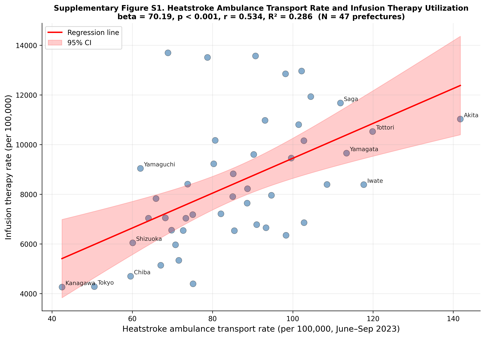
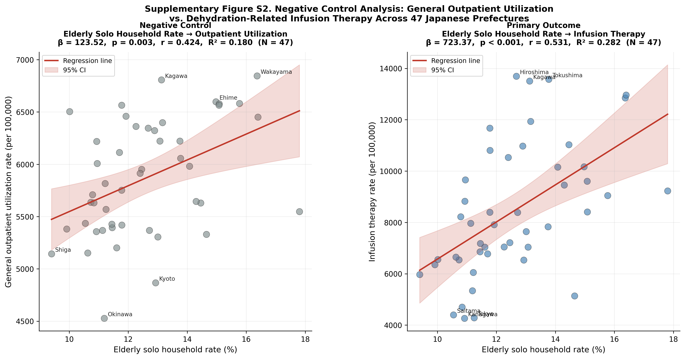

---

# Abstract

## Background

Heat-health warning systems rely on meteorological indicators including temperature and wet-bulb globe temperature (WBGT), but heat outcomes may also reflect social vulnerability. Older adults living alone face additional risk through limited monitoring, delayed help-seeking, and barriers to cooling. We examined whether prefectural-level elderly solo household rate — a community-level marker of social isolation — was associated with dehydration-related healthcare utilization.

## Methods

We conducted an ecological study of 47 Japanese prefectures using fiscal year 2023 data. Infusion therapy utilization (≥500 mL) from the National Database (NDB) Open Data was used as a population-level indicator of dehydration-related healthcare utilization. Elderly solo household rate was derived from the 2020 National Census. Heatwave days and mean WBGT were calculated from Japan Meteorological Agency data for June–September 2023. Predictors were examined using simple linear regression and sensitivity analyses.

## Results

Mean elderly solo household rate was 12.6 ± 1.9% and mean infusion therapy rate was 8,434 ± 2,587 per 100,000 population. Elderly solo household rate was associated with infusion therapy utilization (β = 723.37; 95% CI, 376.52–1,070.21; R² = 0.282; *p* = 0.0001). The association persisted in all sensitivity analyses. Heatwave frequency, WBGT, and air conditioning prevalence were not significant ecological correlates.

## Conclusions

Community-level social isolation was the only ecological factor significantly associated with infusion therapy utilization. Heat-health systems relying solely on meteorological thresholds may overlook socially vulnerable communities. Integrating social vulnerability indicators may improve equitable climate adaptation.

**Keywords:** heat-health surveillance; social isolation; elderly solo household; dehydration; infusion therapy; ecological study; Japan; NDB Open Data

---

# Key Messages

## What is already known on this topic

- Heat-health warning systems in Japan rely primarily on meteorological indicators such as temperature and wet-bulb globe temperature; social vulnerability is not routinely incorporated into surveillance.
- Older adults living alone face additional heat risk through limited monitoring, delayed help-seeking, and barriers to cooling and heat-health information.
- Social isolation was associated with heat-related mortality during the 1995 Chicago and 2003 European heatwaves, but nationwide ecological evidence linking elderly household composition to dehydration-related healthcare utilization in Japan is limited.

## What this study adds

- In a nationwide ecological study of 47 Japanese prefectures, elderly solo household rate — a community-level marker of social isolation — was the only significant predictor of infusion therapy utilization (≥500 mL), a population-level indicator of dehydration-related healthcare; heatwave days, mean wet-bulb globe temperature, and air conditioning prevalence were not significant ecological correlates.
- The association was robust across multiple sensitivity analyses and was approximately six-fold stronger than that observed for general outpatient utilization rate, suggesting partial specificity for heat-related dehydration beyond general healthcare access.

## How this study might affect research, practice or policy

- Heat-health surveillance systems relying solely on meteorological thresholds may overlook communities where older adults are least able to respond to heat warnings or obtain timely care.
- Prefectures with high elderly solo household rates may benefit from targeted welfare checks, community-based monitoring programmes, cooling support, and accessible health communication during heat alerts.
- Integrating routinely available social vulnerability indicators into existing heat-health surveillance may improve equitable climate adaptation in ageing societies.

---

# Introduction

Heat-related illness is an increasingly urgent public health challenge in Japan. In 2023, heatstroke caused 1,580 deaths, and emergency transports for suspected heatstroke reached 91,467 cases.1), 2) Climate change, population aging, and urbanization are expected to increase this burden.3), 4)

Heat-health responses have therefore emphasized meteorological surveillance. Temperature, humidity, and WBGT are established proximal determinants of heatstroke,5), 6) and Japan has implemented WBGT forecasting and heat alert systems.7) These systems are essential, but they primarily describe environmental hazard. They do not necessarily identify communities least able to receive warnings, act on them, or obtain timely assistance.

Heat risk is produced by both environmental exposure and social vulnerability. Older adults are physiologically vulnerable to heat because of reduced sweating capacity, diminished thirst perception, impaired thermoregulation, and chronic disease.10), 11) Among older adults, those living alone may face additional risk through limited informal monitoring, economic barriers to cooling, delayed help-seeking, and reduced access to heat-health information.12)–19)

Despite this concern, heat-health research and surveillance remain more developed for monitoring meteorological hazard than social vulnerability. Japanese studies have examined individual risk factors and ambulance transport data,20), 21) but nationwide ecological evidence linking social isolation to dehydration-related healthcare utilization is limited. We therefore examined whether elderly solo household rate could serve as a practical social vulnerability layer complementing climatic indicators in heat-health surveillance.

---

# Methods

## 1. Study Design

We conducted a nationwide ecological study using Japanese prefectures (N = 47) as the unit of analysis. Prefecture-level aggregate data were used because individual household and geospatial information is not available from NDB Open Data. The study period was fiscal year 2023 (April 2023 through March 2024); climatic exposures were measured during the summer season (June–September 2023).

## 2. Outcome: Infusion Therapy Utilization

Infusion therapy utilization rates were derived from the 10th NDB Open Data. We extracted claims for infusion procedures involving ≥500 mL volume (procedure code: G004), commonly used for rehydration in moderate-to-severe dehydration from heat illness or other acute conditions.11) Because the outcome is not heat-specific, we interpreted it as a population-level indicator of dehydration-related healthcare utilization. Rates were calculated per 100,000 population using the 2020 National Census. As a construct validity check, we examined the cross-prefectural correlation between infusion therapy utilization rate and the summer 2023 heatstroke ambulance transport rate derived from the Fire and Disaster Management Agency (FDMA) daily transport report (Supplementary Figure S1).1)

## 3. Exposure: Elderly Solo Household Rate

Elderly solo household rate was defined as the percentage of all households consisting of one person aged ≥65 years, derived from the 2020 National Census. This measure was interpreted as a community-level marker of social isolation.

## 4. Climatic Covariates

Heatwave exposure was defined as the number of days with maximum temperature ≥35°C during June–September 2023, averaged across Japan Meteorological Agency (JMA) weather stations within each prefecture. Mean WBGT was estimated from daily mean temperature (T, °C) and relative humidity (RH, %) using a simplified approximation: wet-bulb temperature Tw = T − (100 − RH)/5; WBGT = 0.7 × Tw + 0.3 × T, averaged over all JMA stations and the summer season (June–September 2023).22), 23) This formula provides an indoor-equivalent WBGT approximation from routinely available meteorological observations. To assess whether additional dimensions of temperature exposure might explain the infusion therapy pattern, four supplementary climate variables were derived from the same JMA station data: (1) mean daily maximum temperature (°C); (2) standard deviation of daily maximum temperature as a measure of temperature variability; (3) mean diurnal temperature range (daily maximum minus daily minimum temperature, °C); and (4) rapid-change days, defined as the number of days on which the day-to-day change in daily maximum temperature exceeded 5°C. These four variables were examined in univariate regression against infusion therapy utilization and results are presented in Table 2.

## 5. Additional Covariates

Air conditioning prevalence (proportion of households owning at least one air conditioning unit, %) was obtained from the 2014 National Survey of Family Income and Expenditure. Aging rate (proportion of individuals aged ≥65 years) was not available in the analysis dataset and was therefore not included.

## 6. Statistical Analysis

We summarized all variables using means, standard deviations, medians, and ranges. Given substantial collinearity among ecological predictors (variance inflation factor >10 in preliminary multivariable models), each factor was examined separately using simple linear regression with infusion therapy utilization as the outcome. This approach estimated policy-interpretable population-level associations rather than a predictive multivariable model.

Three sensitivity analyses assessed the robustness of the primary finding: (1) **Outlier exclusion**: We calculated Cook's distance for each prefecture and excluded observations exceeding 4/N (N = 47 = 0.085). (2) **Tokyo exclusion**: We repeated the base model excluding Tokyo, given its extreme urbanization and population density. (3) **Stratified analysis**: We stratified prefectures by the median elderly solo household rate (12.3%) and fit separate regression models within each stratum to explore effect heterogeneity across the exposure distribution.

Regression coefficients (β), 95% confidence intervals (CIs), R², adjusted R², and *p*-values are reported. Statistical significance was defined as two-sided *p* < 0.05. Analyses were performed using Python (version 3.13), statsmodels (version 0.13), and matplotlib.

This study used publicly available aggregate data; individual informed consent was not required, and institutional ethics review was not applicable in accordance with Japanese ethical guidelines for epidemiological research.

---

# Results

## 1. Descriptive Statistics

Across the 47 Japanese prefectures, the mean elderly solo household rate was 12.6 ± 1.9% (range: 9.4–17.8%) (Table 1). Mean infusion therapy utilization was 8,434 ± 2,587 per 100,000 population (range: 4,267–13,697). Mean heatwave days (maximum temperature ≥35°C) were 17.9 ± 12.1 days (range: 0.0–44.0 days), and mean summer WBGT was 23.2 ± 1.0°C (range: 19.8–26.3°C). Mean air conditioning prevalence was 89.7 ± 13.6% (range: 26.6–98.2%).

## 2. Univariate Regression Analysis

Elderly solo household rate was the only significant predictor of infusion therapy utilization in univariate regression (β = 723.37; 95% CI, 376.52–1,070.21; R² = 0.282; *p* = 0.0001) (Table 2). Each one-percentage-point increase in elderly solo household rate was associated with approximately 723 additional infusion procedures per 100,000 population. Heatwave days, WBGT, and air conditioning prevalence were not significantly associated with infusion therapy utilization. Four additional climate variables — mean daily maximum temperature, temperature variability (SD of daily maximum temperature), mean diurnal temperature range, and rapid-change days (≥5°C day-to-day change) — were also not significantly associated (all *p* > 0.34) (Table 2).

## 3. Sensitivity Analysis: Outlier Exclusion

Cook's distance analysis identified Hokkaido and Kochi as influential observations exceeding the threshold of 4/N = 0.085. After excluding these two prefectures (N = 45), the association strengthened (β = 925.11; 95% CI, 564.74–1,285.47; R² = 0.384; *p* < 0.001) (Table 3).

## 4. Sensitivity Analysis: Tokyo Exclusion

After excluding Tokyo (N = 46), the association remained statistically significant (β = 696.92; 95% CI, 352.45–1,041.39; R² = 0.274; *p* = 0.0002) (Table 3), indicating that the finding was not driven by the unique characteristics of Japan's largest metropolitan area.

## 5. Stratified Analysis by Elderly Solo Household Rate

When prefectures were stratified by the median elderly solo household rate (12.3%), the association differed between strata. In the lower stratum (N = 23, rate <12.3%), the association was statistically significant (β = 1,254.30; 95% CI, 7.69–2,500.92; R² = 0.173; *p* = 0.049). In the higher stratum (N = 24, rate ≥12.3%), the association was not statistically significant (β = 264.50; 95% CI, −461.52–990.53; R² = 0.025; *p* = 0.458) (Table 3). The estimated coefficient differed between strata (lower stratum β = 1,254.30 vs. higher stratum β = 264.50).

## 6. Construct Validity: FDMA Heatstroke Transport Validation

As a construct validity check, infusion therapy utilization rate was examined in relation to the summer 2023 heatstroke ambulance transport rate (per 100,000 population) derived from FDMA.1) A significant positive association was observed (β = 70.19; 95% CI, 36.85–103.53; r = 0.534; *p* < 0.001; Supplementary Figure S1), supporting the use of infusion therapy as a population-level indicator of heat-related dehydration.

## 7. Negative Control: Outpatient Utilization Rate

To assess whether the primary association might reflect general healthcare access rather than heat-related dehydration specifically, we examined the association between elderly solo household rate and general outpatient utilization rate derived from the R5 Patient Survey (Ministry of Health, Labour and Welfare), which represents all outpatient visits per 100,000 population. General outpatient utilization was significantly associated with elderly solo household rate (β = 123.52; 95% CI, 44.30–202.74; R² = 0.180; *p* = 0.003; Supplementary Figure S2). However, the association was substantially weaker than that observed for infusion therapy: the β coefficient was approximately six-fold smaller (123.52 vs. 723.37) and explained less variance (R² = 0.180 vs. 0.282). This comparison suggests that while elderly solo household rate captures some component of general healthcare utilization, the much stronger association with infusion therapy may reflect heat-related dehydration beyond what would be expected from general healthcare access patterns alone.

---

# Discussion

Heat-health surveillance has traditionally focused on *where* heat occurs. Our findings suggest that surveillance should also identify *where* people are least able to respond to heat. In this nationwide ecological analysis, elderly solo household rate was robustly associated with infusion therapy utilization, while heatwave days and WBGT were not significant ecological correlates. This pattern suggests that social isolation may capture a surveillance-relevant dimension of heat vulnerability not represented by meteorological hazard alone.

The association is plausible because living alone can amplify heat risk between exposure and care. Older adults may have reduced thermoregulation and blunted thirst perception,10), 11), 24), 25) while living alone may reduce informal prompts to use air conditioning, drink fluids, or seek care. Economic concerns can further limit cooling use despite high air conditioning ownership.14), 15) Social isolation may also delay recognition of confusion, dehydration, or reduced activity, and may limit receipt of digital heat alerts or interpretation of general heat-health advice.16)–19), 29)

Our findings align with international evidence that social isolation increases heat-related mortality, including the 1995 Chicago and 2003 European heat waves.12), 13), 16), 28) This study extends that literature by using nationwide administrative and census data to link an available household-composition indicator with dehydration-related healthcare utilization.

Japanese studies have identified advanced age and comorbidity as heatstroke risk factors,20), 21) but fewer have examined social isolation as a prefecture-level surveillance indicator. The estimate of approximately 723 additional infusion procedures per 100,000 population for each one-percentage-point increase in elderly solo household rate may be useful for prioritizing outreach and resource allocation.

The absence of significant associations for heatwave days and WBGT should not be interpreted as evidence that climate is unimportant. Infusion therapy is not heat-specific, prefecture-level climatic averages may miss neighborhood and indoor exposures, and regional heat adaptation may attenuate simple ecological climate-health associations.8), 9), 30) These considerations support combining meteorological indicators with social and built-environment indicators.

These findings have implications for heat-health surveillance and climate adaptation policy. WBGT-based alerts remain essential, but they cannot determine who is likely to be missed. Prefectures with high elderly solo household rates could prioritize welfare checks, community-based *Mimamori* programs, cooling support, and accessible, plain-language health communication during heat alerts.

A layered system could combine meteorological hazard forecasts with social vulnerability indicators such as elderly solo household rate and cooling access.26) Such an approach would not replace climate alerts; it would guide where outreach, social care, and clinical preparedness should be intensified. Heat adaptation has primarily been framed as a meteorological problem; our findings suggest it should also be understood as a social care problem, supporting integration of social vulnerability into existing heat-health surveillance rather than replacement of meteorological warning systems.

Strengths include nationwide coverage of all 47 prefectures, use of NDB Open Data with comprehensive insurance claims, and robustness across multiple sensitivity analyses. The ecological design also demonstrates how routinely available social indicators may strengthen heat-health surveillance.

Several limitations should be considered. First, ecological associations may not reflect individual-level relationships. We cannot determine whether individuals living alone within a prefecture had higher infusion therapy utilization than those living with family. Second, this study did not directly evaluate heat warning systems; "socially blind" should be interpreted as a policy hypothesis, not a direct criticism of existing systems. Third, the cross-sectional design precludes causal inference.

Fourth, because multivariable ecological modeling was not feasible owing to substantial collinearity, residual confounding cannot be excluded. Fifth, infusion therapy utilization is not heat-specific and captures dehydration from multiple causes, which may bias associations toward the null. Heat-specific diagnoses would strengthen inference but are not available in prefecture-level NDB Open Data. Additionally, monthly aggregation of procedure claims is not available in prefecture-level NDB Open Data; therefore, it was not possible to verify that infusion therapy utilization peaks during summer months, as would be expected if the outcome primarily captures heat-related dehydration. As a negative control, general outpatient utilization rate (R5 Patient Survey) was also significantly associated with elderly solo household rate (β = 123.52; 95% CI, 44.30–202.74; R² = 0.180; *p* = 0.003; Supplementary Figure S2); however, the β coefficient was approximately six-fold smaller than for infusion therapy (123.52 vs. 723.37) and explained less variance (R² = 0.180 vs. 0.282), suggesting partial specificity of the primary association beyond general healthcare access. Cross-validation against the 2023 summer FDMA heatstroke ambulance transport rate (r = 0.53, *p* < 0.001; Supplementary Figure S1)1) further supported the use of infusion therapy as a population-level proxy for heat-related dehydration.

Sixth, unmeasured confounding by socioeconomic status, healthcare access, chronic disease, medication use, housing, and urban heat islands may remain. Climatic measures were prefecture-level averages and did not capture indoor or neighborhood exposures.

Seventh, WBGT was estimated using a simplified approximation (Tw = T − (100 − RH)/5; WBGT = 0.7 × Tw + 0.3 × T) applied to daily mean temperatures. This indoor-equivalent formula may underestimate peak outdoor heat stress, which could attenuate the observed association between WBGT and healthcare utilization. Finally, air conditioning prevalence was derived from 2014 survey data; while national ownership rates have remained high in Japan, the extreme lower range observed in this study (26.6% in one prefecture) likely reflects historical underuse in cold-climate prefectures that may have changed in recent years. The present findings should be interpreted as evidence for surveillance prioritization rather than causal evidence of heat-related illness.

---

# Conclusions

In this nationwide ecological study, elderly solo household rate was associated with dehydration-related healthcare utilization across Japanese prefectures in univariate analyses. The association was consistent across multiple sensitivity analyses, whereas heatwave days and WBGT were not significant ecological correlates.

These findings suggest that social isolation may be a missing layer in heat-health surveillance. Meteorological thresholds identify hazardous heat, but they may not identify communities where older adults are least able to receive warnings, initiate protective behavior, or obtain assistance. Integrating routinely available social indicators into existing surveillance systems may improve equitable heat adaptation in aging societies.

Future individual-level and longitudinal studies are needed to confirm these population-level findings and to clarify pathways linking social isolation, heat exposure, and dehydration-related healthcare use.

---

# Acknowledgments

The authors thank the Ministry of Health, Labour and Welfare of Japan for providing access to the NDB Open Data. All data used are publicly available aggregate statistics.

---

# Conflicts of Interest

The authors declare no conflicts of interest.

---

# Data Availability

The NDB Open Data used in this analysis are publicly available from the Ministry of Health, Labour and Welfare of Japan (https://www.mhlw.go.jp/stf/seisakunitsuite/bunya/0000177182.html). The analysis code is openly available on GitHub (https://github.com/haruki00430/NDB_XXX_heatwave_heatstroke) and archived on Zenodo (https://doi.org/10.5281/zenodo.20740375).

---

# Author Contributions

Haruki Saito: Conceptualization, Data curation, Formal analysis, Investigation, Methodology, Software, Visualization, Writing – original draft, Writing – review and editing.

Tetsuya Ohira: Conceptualization, Supervision, Writing – review and editing.

---

# Funding

None declared.

---

# Declaration of Generative AI and AI-Assisted Technologies in the Manuscript Preparation Process

During the preparation and writing of this work, the authors used AI-assisted tools to support manuscript drafting and statistical analysis scripting. Cursor 3.0 (Anysphere) and Google Antigravity (Google) were used for AI-assisted writing and Python code development. Large language models used through these platforms included Claude Sonnet 4.6 and Claude Opus 4.8 (Anthropic) and GPT-5.5 (OpenAI) and Gemini 3 Pro (Google). These tools were used only for text drafting and code generation; no generative AI or AI-assisted tools were used to create, alter, or otherwise process any figures, images, or artwork in this manuscript. The authors reviewed and edited all AI-assisted outputs and were responsible for the study design, selection of statistical methods, interpretation of findings, conclusions, and final reference list. The authors take full responsibility for the integrity and accuracy of the final content. AI was not listed as an author.

---

# References

1) Fire and Disaster Management Agency. Daily number of patients with heatstroke transported by ambulance in Japan. Tokyo: Fire and Disaster Management Agency (FDMA), Ministry of Internal Affairs and Communications; 2023. Available from: https://www.fdma.go.jp/disaster/heatstroke/post4.html
2) Ministry of Health, Labour and Welfare. Vital Statistics: Annual status of deaths due to heatstroke in Japan. Tokyo: MHLW; 2024. Available from: https://www.mhlw.go.jp/toukei/saikin/hw/jinkou/tokusyu/necchusho24/index.html
3) Intergovernmental Panel on Climate Change (IPCC). Climate Change 2021: The Physical Science Basis. Contribution of Working Group I to the Sixth Assessment Report. Cambridge: Cambridge University Press; 2021. Available from: https://www.ipcc.ch/report/ar6/wg1/
4) Günsche S, Borg MA, Anikeeva O, Varghese BM, Li Y, Bhandari D, et al. Mortality, morbidity and healthcare costs of short-term high temperatures and heatwaves exposure in older populations: a global systematic review and meta-analysis. Environ Int. 2026;208:110129. doi:10.1016/j.envint.2026.110129
5) Parsons K. Heat stress standard ISO 7243 and its global application. Ind Health. 2006;44(3):368-379. doi:10.2486/indhealth.44.368
6) Blazejczyk K, Epstein Y, Jendritzky G, Staiger H, Tinz B. Comparison of UTCI to selected thermal indices. Int J Biometeorol. 2012;56(3):515-535.
7) Ministry of the Environment, Government of Japan. Heat Illness Prevention Information: Heat Stress Index (WBGT) and Heat Stroke Alerts. Available from: https://www.wbgt.env.go.jp/en/
8) Hondula DM, Balling RC, Andrade R, Krayenhoff ES, Middel A, Urban A, Georgescu M, Sailor DJ. Biometeorology for cities. Int J Biometeorol. 2017;61(Suppl 1):59-69.
9) Harlan SL, Declet-Barreto JH, Stefanov WL, Petitti DB. Neighborhood effects on heat deaths: social and environmental predictors of vulnerability in Maricopa County, Arizona. Environ Health Perspect. 2013;121(2):197-204.
10) Kenney WL, Munce TA. Invited review: aging and human temperature regulation. J Appl Physiol (1985). 2003;95(6):2598-2603.
11) Bouchama A, Knochel JP. Heat stroke. N Engl J Med. 2002;346(25):1978-1988.
12) Vandentorren S, Bretin P, Zeghnoun A, et al. August 2003 heat wave in France: risk factors for death of elderly people living at home. Eur J Public Health. 2006;16(6):583-591.
13) Canouï-Poitrine F, Cadot E, Spira A, Groupe Régional Canicule. Excess deaths during the August 2003 heat wave in Paris, France. Rev Epidemiol Sante Publique. 2006;54(2):127-135. doi:10.1016/S0398-7620(06)76706-2
14) Ministry of Internal Affairs and Communications. National Survey of Family Income and Expenditure 2014. Tokyo: MIC; 2015.
15) Farbotko C, Waitt G. Residential air-conditioning and climate change: voices of the vulnerable. Health Promot J Austr. 2011;22(4):13-15.
16) Semenza JC, Rubin CH, Falter KH, et al. Heat-related deaths during the July 1995 heat wave in Chicago. N Engl J Med. 1996;335(2):84-90.
17) Naughton MP, Henderson A, Mirabelli MC, et al. Heat-related mortality during a 1999 heat wave in Chicago. Am J Prev Med. 2002;22(4):221-227.
18) Oberai M, Xu Z, Bach A, Forbes C, Jackman E, O'Connor F, et al. A digital heat early warning system for older adults. NPJ Digit Med. 2025;8(1):114. doi:10.1038/s41746-025-01505-5
19) Zhang C, Mohamad E, Azlan AA, Wu A, Ma Y, Qi Y. Social media and eHealth literacy among older adults: systematic literature review. J Med Internet Res. 2025;27:e66058. doi:10.2196/66058
20) Ng CF, Ueda K, Takeuchi A, et al. Sociogeographic variation in the effects of heat and cold on daily mortality in Japan. J Epidemiol. 2014;24(1):15-24. doi:10.2188/jea.JE20130051
21) Miyatake N, Sakano N, Murakami S. The relation between ambulance transports stratified by heat stroke and air temperature in all 47 prefectures of Japan in August, 2009: Ecological study. Environ Health Prev Med. 2012;17(1):77-80.
22) Patel T, Mullen SP, Santee WR. Comparison of methods for estimating wet-bulb globe temperature index from standard meteorological measurements. Mil Med. 2013;178(8):926-933. doi:10.7205/MILMED-D-13-00117
23) Liljegren JC, Carhart RA, Lawday P, Tschopp S, Sharp R. Modeling the wet bulb globe temperature using standard meteorological measurements. J Occup Environ Hyg. 2008;5(10):645-655.
24) Bach AJE, Cunningham SJK, Morris NR, Xu Z, Rutherford S, Binnewies S, et al. Experimental research in environmentally induced hyperthermic older persons: a systematic quantitative literature review mapping the available evidence. Temperature (Austin). 2024;11(1):4-26. doi:10.1080/23328940.2023.2242062
25) Blatteis CM. Age-dependent changes in temperature regulation - a mini review. Gerontology. 2012;58(4):289-295.
26) Romitti Y, Sue Wing I, Spangler KR, Wellenius GA. The effects of residential air conditioning and social vulnerability on heat-related hospitalizations in California. Environ Int. 2025;202:109659. doi:10.1016/j.envint.2025.109659
27) Weisskopf MG, Anderson HA, Foldy S, et al. Heat wave morbidity and mortality, Milwaukee, Wis, 1999 vs 1995: an improved response? Am J Public Health. 2002;92(5):830-833.
28) Conti S, Meli P, Minelli G, et al. Epidemiologic study of mortality during the Summer 2003 heat wave in Italy. Environ Res. 2005;98(3):390-399.
29) Berkman ND, Sheridan SL, Donahue KE, Halpern DJ, Crotty K. Low health literacy and health outcomes: an updated systematic review. Ann Intern Med. 2011;155(2):97-107.
30) Oka K, Honda Y, Hui Phung VL, Hijioka Y. Potential effect of heat adaptation on association between number of heatstroke patients transported by ambulance and wet bulb globe temperature in Japan. Environ Res. 2023;216(Pt 3):114666. doi:10.1016/j.envres.2022.114666

---

# Tables and Figures

## Table 1. Descriptive Statistics of Prefecture-Level Variables (N = 47)

| Variable | Unit | N | Mean | SD | Min | Median | Max |
| :--- | :--- | ---: | ---: | ---: | ---: | ---: | ---: |
| **Outcome variable** | | | | | | | |
| Infusion therapy rate (≥500 mL) | per 100,000 | 47 | 8,434 | 2,587 | 4,267 | 7,962 | 13,697 |
| **Exposure variable** | | | | | | | |
| Elderly solo household rate | % | 47 | 12.6 | 1.9 | 9.4 | 12.3 | 17.8 |
| **Climatic variables** | | | | | | | |
| Heatwave days (≥35°C) | days | 47 | 17.9 | 12.1 | 0.0 | 17.0 | 44.0 |
| Mean WBGT (June–Sep) | °C | 47 | 23.2 | 1.0 | 19.8 | 23.4 | 26.3 |
| **Covariate variable** | | | | | | | |
| Air conditioning prevalence | % | 47 | 89.7 | 13.6 | 26.6 | 94.8 | 98.2 |

WBGT, wet-bulb globe temperature; SD, standard deviation. Air conditioning prevalence from 2014 National Survey of Family Income and Expenditure.

---

## Table 2. Univariate Linear Regression: Association between Each Predictor and Infusion Therapy Utilization (N = 47)

| **Variable** | **β (95% CI)** | ***p*** | **R²** | **Adj. R²** |
| :--- | ---: | ---: | ---: | ---: |
| **Elderly solo household rate (per 1%)** | **723.37 (376.52, 1,070.21)** | **0.0001** | **0.282** | **0.266** |
| Air conditioning prevalence (per 1%) | 31.23 (−24.98, 87.45) | 0.269 | 0.027 | 0.005 |
| Heatwave days (per 1 day) | −33.96 (−97.42, 29.51) | 0.287 | 0.025 | 0.003 |
| Mean WBGT (per 1°C) | 94.32 (−658.68, 847.32) | 0.802 | 0.001 | −0.021 |
| **Additional climate variables** | | | | |
| Mean daily maximum temperature (per 1°C) | −145.83 (−861.66, 570.00) | 0.684 | 0.004 | −0.018 |
| SD of daily maximum temperature (per 1°C) | −586.99 (−2,060.21, 886.23) | 0.427 | 0.014 | −0.008 |
| Mean diurnal temperature range (per 1°C) | −307.32 (−961.69, 347.06) | 0.349 | 0.019 | −0.003 |
| Rapid-change days ≥5°C (per 1 day) | −42.32 (−190.74, 106.10) | 0.569 | 0.007 | −0.015 |

**Bold** indicates *p* < 0.05. Additional climate variables derived from Japan Meteorological Agency daily temperature data (June–September 2023).

---

## Table 3. Sensitivity Analyses: Association between Elderly Solo Household Rate and Infusion Therapy Utilization

| **Analysis** | **N** | **β (95% CI)** | ***p*** | **R²** | **Outliers Excluded** |
| :--- | ---: | ---: | ---: | ---: | :--- |
| **Base model** | 47 | **723.37 (376.52, 1,070.21)** | **0.0001** | **0.282** | – |
| **Outlier exclusion** | 45 | **925.11 (564.74, 1,285.47)** | **<0.001** | **0.384** | Hokkaido, Kochi |
| **Tokyo exclusion** | 46 | **696.92 (352.45, 1,041.39)** | **0.0002** | **0.274** | Tokyo |
| **Stratified: High elderly solo HH rate (≥12.3%)** | 24 | 264.50 (−461.52, 990.53) | 0.458 | 0.025 | – |
| **Stratified: Low elderly solo HH rate (<12.3%)** | 23 | **1,254.30 (7.69, 2,500.92)** | **0.049** | **0.173** | – |

**Bold** indicates *p* < 0.05. HH, household.

---

## Figure Legends

**Figure 1.** Cook's distance plot for outlier detection. Two prefectures (Hokkaido and Kochi) exceeded the conventional threshold of 4/N = 0.085, indicating influential observation status.

**Figure 2.** Scatter plot showing the association between elderly solo household rate (%) and infusion therapy utilization (per 100,000 population) across 47 Japanese prefectures, stratified by the median elderly solo household rate (12.3%). Solid line represents the linear regression fit within each stratum, with shaded area indicating 95% confidence interval. Top 5 and bottom 5 prefectures by infusion therapy rate are labeled.

**Figure 3.** Scatter plot showing the association between elderly solo household rate (%) and infusion therapy utilization (per 100,000 population) across all 47 Japanese prefectures. Solid line represents the simple linear regression fit (β = 723.37, *p* = 0.0001, R² = 0.282), with shaded area indicating 95% confidence interval.

## Figure 1

## Figure 2

## Figure 3

---

## Supplementary Figure S1

**Supplementary Figure S1.** Scatter plot showing the cross-prefectural association between heatstroke ambulance transport rate (Fire and Disaster Management Agency, per 100,000 population, June–September 2023) and infusion therapy utilization rate (per 100,000 population) across 47 Japanese prefectures. Solid line represents the simple linear regression fit (β = 70.19; 95% CI, 36.85–103.53; *p* < 0.001; r = 0.534), with shaded area indicating 95% confidence interval. Top 5 and bottom 5 prefectures by heatstroke transport rate are labeled. This cross-validation supports the use of infusion therapy as a population-level indicator of heat-related dehydration.

---

## Supplementary Figure S2

**Supplementary Figure S2.** Side-by-side scatter plots comparing the association between elderly solo household rate (%) and (left panel) general outpatient utilization rate (negative control; R5 Patient Survey, per 100,000 population) and (right panel) infusion therapy utilization rate (primary outcome; NDB Open Data, per 100,000 population) across 47 Japanese prefectures. Solid lines represent simple linear regression fits with shaded 95% confidence intervals. General outpatient utilization was significantly but weakly associated with elderly solo household rate (β = 123.52; 95% CI, 44.30–202.74; *p* = 0.003; R² = 0.180), whereas the association with infusion therapy was approximately six-fold stronger (β = 723.37; 95% CI, 376.52–1,070.21; *p* < 0.001; R² = 0.282), supporting partial specificity of the primary association beyond general healthcare access.

